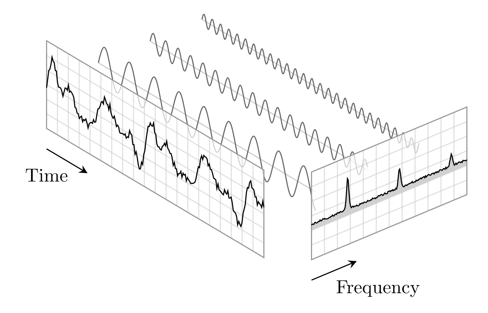

# LaTeX and TikZ examples

Author: [Tobit Flatscher](https://github.com/2b-t) (2018-2020)

  

A couple of (animated) vector figures created with [LaTeX](https://www.latex-project.org/) and [TikZ](https://en.wikipedia.org/wiki/PGF/TikZ).

Currently this repository contains the following examples:

- An animated [**cosmological model of concentric spheres**](./build/EudoxusPlanetary.pdf) [(Eudoxus planetary model)](https://en.wikipedia.org/wiki/Concentric_spheres). The interesting thing about this graphic is that it involves two coordinate transformations, one of which is performed manually.
- [Another one displays](./build/FluidScales.pdf) the **different scales of fluid models**. It demonstrates the usage of patterns and generation of random values.
- The principle of the [**Fourier analysis**](https://en.wikipedia.org/wiki/Fourier_analysis) is illustrated in [yet another file](./build/FourierAnalysis.pdf).
- [The last example](./build/StokesFormula.pdf) shows how the [**Stokes' law**](https://en.wikipedia.org/wiki/Stokes%27_law) [can be derived by means of integration of stresses](https://physics.stackexchange.com/a/537854/245414).

For opening the animated figures on Linux I recommend using [Okular](https://okular.kde.org/) as many other common document viewers do not support it.

## Usage

Clearly you can open the `*.tex` files located in [`src`](./src) in your favourite LaTeX editor such as TexStudio. Otherwise this repository also comes with a Makefile which will compile all the `*.tex` files located in the [`src`](./src) folder to the [`build`](./build) folder. This requires the [`latexmk` package](https://ctan.org/pkg/latexmk?lang=en), which can be installed on Ubuntu with `$ apt-get -y update latexmk`.

The [Makefile](./Makefile) has two rules:

- `$ make all` compiles all individual `*.tex` files to `*.pdf` files

- `$ make clean` deletes all the files again that were generated during the compilation

In case you do not want to install LaTeX on your computer this repository also comes with a [Docker](https://www.docker.com/) (see the folder `docker`) and a corresponding [Docker-Compose](https://docs.docker.com/compose/) file.
